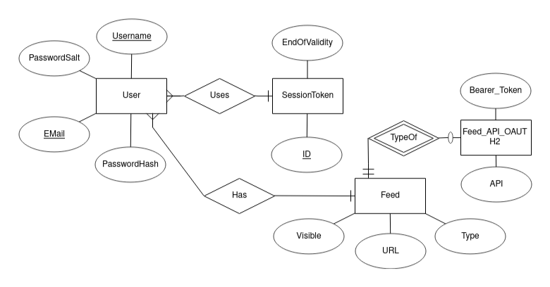

# No Name Given

## Design Concept

A website where you can summarize all your Feeds into one.
One would link all their other social networks, like FB, IG, Reddit, Twitter, and have one nice feed created from them.
Of course, I will only start by allowing the use of a few basic APIs,
and of course I want to synchronize the auth tokens of the users so that the user only logs in with their one account for this page
and has all the others all prepared.
If possible, RSS feeds should also work.
I would definitely use the product, and no doubt I still see people open Twitter first and then Instagram,
I would at least notice if someone wrote to me on a page that I no longer want to check,
among other things I would connect about 8 different places, I could have one app instead of 5 apps and 3 pages.

You can probably use classic React.ts and ASP.NET here.

## Functional and Non-functional specification

### Functional

- Goals - Retrieve feeds from various sources and display them on one page
- The system will allow users to login and register
- A user has:
  - Feeds - a link to an external source of posts, with authentication
    - Depending on time constraints the feeds added will be
      - RSS
      - External API (Twitter and Reddit)
      - HTML Parser
  - Views - A user has views to which they can add feeds which they want to see on one page, basically acting as Feed Groups
- When viewing a post, depending on the feed type, the user should be able to interact with it, I.E.
  - Up/Downvote
  - View and Make Comments

### Non-Functional

- Log-in using third-party Auth0 provider
- ASP.NET WebAPI - for API
- Microsoft MS SQL database - for Database
- React.js - for frontend Website and API calls

## Functional Use Case Scripts

- **AuthenticateUser:**
  - If no authentication token is detected, an existing user will have to navigate to the login page, where they are presented with a form including a username, password and a submit button, and enter their username and password, to recieve a new one
  - **Exception:** If the username is not found in the database, the user will be informed of this fact and a suggestion will be made to register.
  - **Exception:** The password is incorrect, an invalid password warning is presented to the user.
- **RegisterUser:**
  - The user visits the register screen, where they are prompted essentially with an identical form to the login form, where the user enrolls a new user entry
  - **Exception:** If the username already exists the user is informed and the usercase restarts.
  - **Exception:** If the password does not meet the password policy, the user is informed, the password policy is displayed and the usercase restarts.
- **RemoveAuthentication:**
  - By clicking the Logout button the page will attempt to remove any and all locally stored authentication information.
- **ModifyFeeds:**
  - After navigating to the Feed management screen the user is presented with a list of their feeds each having an edit and delete button, as well as all the kept information about them, and a button to add a new feed.
  - If the user clicks add new, they are taken to a form where they enter information based on the type of feed and enroll it by clicking save, if the user clicked edit this form is pre-filled with that feed's information and changes it instead of adding a new one.
  - Deleting requires a secondary acceptance in a pop-up box
  - **Exception:** If the user wishes to cancel an edit, they click the cancel button in the edit form and the usecase restarts.
- **ShowView:**
  - On the main page, the user is greeted by a chronological post stream from their feeds
  - The user may use the sidebar to show and hide different feeds
  - **Exception:** No connectivity or unexpected response from one or more servers, will result in that feed being marked so
- **ReactToPost:**
  - Posts from feeds that support reactions, have reaction buttons and a comment entry field
  - **Exception:** The API call fails for some reason, An alert is displayed to the user, with a button that displays the entire JSON answer recieved.

## Conceptual Model

